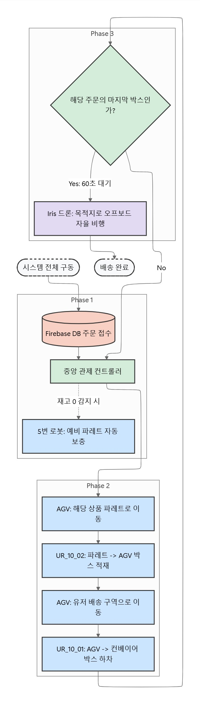
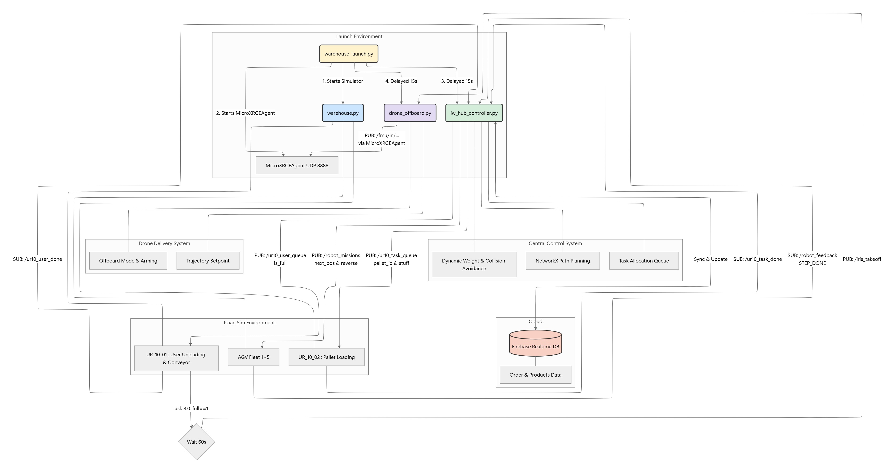

#  EIUM - 스마트 물류 자동화 디지털 트윈 프로젝트 (Isaac Sim + ROS 2 + PX4)

이 프로젝트는 **ROS 2 Humble**과 **NVIDIA Isaac Sim (5.0)** 환경에서 구동되는 완전 자율 스마트 물류 창고 시스템입니다. 
클라우드 DB(Firebase) 연동을 통한 실시간 주문 처리부터 다중 물류 로봇(AGV) 관제, UR10 로봇팔을 이용한 정밀 매니퓰레이션, 그리고 드론을 활용한 라스트 마일 배송까지 물류 자동화의 **풀 사이클(Full-Cycle)**을 시뮬레이션 환경에 성공적으로 구현했습니다.

---

## 주요 기능 (Key Features)

### 1. 클라우드 연동 실시간 WMS (Cloud-Integrated WMS)
- **주문 동기화:** Firebase Realtime Database를 통해 고객의 주문을 실시간으로 수신하고, 이를 개별 Task로 분할하여 AGV에 할당합니다.
- **자동 재고 보충:** DB 상의 재고(Stock)가 0이 되는 순간을 감지하여, 대기 중인 5번 로봇이 자동으로 예비 파레트를 밀어넣어 재고를 보충합니다.

### 2. 동적 경로 계획 기반 다중 로봇 관제 (Dynamic Fleet Management)
- **알고리즘:** `NetworkX`를 활용해 물류 창고의 노드 맵을 구축하고 최단 경로를 탐색합니다.
- **교착 상태 회피:** 타 로봇이 점유한 노드에 동적으로 높은 가중치를 부여하고, 좁은 파레트 구역에서는 후진(Reverse) 기동을 구현하여 로봇 간 충돌 및 병목 현상을 방지합니다.

### 3. 상태 머신 및 RMPflow 기반 정밀 제어 (Precise Manipulation)
- **역할 분담:** 2대의 UR10 로봇팔을 적재용(파레트 ➡️ AGV)과 하차용(AGV ➡️ 컨베이어)으로 분리하여 제어합니다.
- **궤적 제어:** Isaac Sim의 `RMPflow`를 적용하여 부드러운 모션 궤적을 생성하며, 재고 수량 및 주문 상태에 따라 실시간으로 목표 웨이포인트(Waypoint)가 변하는 정교한 상태 머신(State Machine)을 구현했습니다.

### 4. 드론 연동 라스트 마일 배송 (Last-mile Drone Delivery)
- **트리거:** 주문된 마지막 상자가 컨베이어 벨트에 안착하면, 외부의 배송 드론에 이륙 신호를 전송합니다.
- **제어:** PX4 MAVLink 및 `MicroXRCEAgent`를 활용해 드론을 Offboard 모드로 전환하고, 목적지까지 오프보드 자율 비행을 수행합니다.

### 5. React 기반 웹 인터페이스 (Web UI)
로봇 및 시뮬레이션 환경과 실시간으로 상호작용하는 웹 애플리케이션을 제공합니다.
- **사용자 맞춤형 주문 시스템 (User UI):** 사용자가 웹에서 상품을 장바구니에 담아 주문하면, Firebase Realtime Database에 즉각 반영되어 물류 창고의 물리적인 출고 작업(AGV 이동 및 로봇팔 피킹)을 트리거합니다.
- **관리자 통합 관제 대시보드 (Admin UI):** - **실시간 재고 모니터링:** 2x2 그리드 UI를 통해 상품별 현재 적재 상태(최대 4칸)를 직관적으로 시각화하고, 재고 소진 시 즉각적으로 상태를 업데이트합니다.
  - **로봇 상태 트래킹:** 운용 중인 5대 AGV의 실시간 동작 상태(작업 중, 대기 등)와 배터리 잔량을 모니터링하며, 배터리 수준에 따른 동적 경고(초록/노랑/빨강) 기능을 제공합니다.

---

## 🛠️ 시스템 설계 및 플로우 차트 (System Architecture & Flowchart)

전체 시스템은 크게 **Cloud DB(데이터 동기화)**, **Mission Controller(관제 및 판단)**, **Isaac Sim(디지털 트윈 제어)** 세 파트로 구성됩니다.

### 1. 시스템 전체 아키텍처


### 2. 전체 공정 플로우 차트 (Simple)
주문 수신부터 라스트 마일 배송(드론)까지의 전체적인 흐름입니다.


### 3. 상세 통신 플로우 차트 (SI)
ROS 2 토픽 통신 및 DB 연동을 포함한 상세 시스템 플로우입니다.


---

## 💻 개발 환경 (Environment)

- **OS:** Ubuntu 22.04 LTS (Jammy Jellyfish)
- **Middleware:** ROS 2 Humble Hawksbill
- **Simulator:** NVIDIA Isaac Sim (5.0.0)
- **Language:** Python 3.10
- **Frontend (Web UI):** React, Vite, CSS
- **Database/Cloud:** Firebase Realtime Database
- **Key Libraries:** `rclpy`, `networkx`, `firebase-admin`, `px4_msgs`, `isaacsim`, `firebase`

---

## 사용 장비 (Hardware Setup)

본 프로젝트는 디지털 트윈 내에서 다종의 이기종 로봇 에셋을 통합하여 개발되었습니다.

| Component | Type | Description |
| :--- | :--- | :--- |
| **AGV** | Idealworks iw.hub | Differential Drive 물류 로봇 (총 5대 운용) |
| **Manipulator** | Universal Robots UR10 | 산업용 다관절 로봇팔 + Surface Gripper 부착 (총 2대 운용) |
| **UAV (Drone)** | Iris Drone | PX4 기반 쿼드콥터 (Pegasus Simulator 연동) |
| **System** | Smart Conveyor Belt | 유저 하차 및 배송 연결 자동화 컨베이어 |

---

## 의존성 설치 (Installation)

**1. Python 필수 라이브러리 (`requirements.txt`)**
경로 탐색 및 Firebase 통신을 위한 패키지입니다.
```bash
pip install networkx firebase-admin scipy numpy
```

**2. ROS 2 및 통신 관련 패키지 설치**
원활한 통신과 PX4 연동을 위해 통역사(Agent) 및 관련 메시지 패키지가 필요합니다.
```bash
sudo apt update
sudo apt install ros-humble-rmw-fastrtps-cpp

# MicroXRCEAgent (PX4 MAVLink 통신용) 설치 권장
```

**3. Web UI 실행 (선택 사항)**
로컬 환경에서 프론트엔드 대시보드를 구동하려면 Node.js 환경에서 아래 명령어를 실행합니다.
```bash
cd web_ui # (실제 웹 UI 폴더 경로로 변경)
npm install
npm run dev
```
*주의: Firebase 보안 키 (`serviceAccountKey.json`) 및 클라이언트 API 키는 깃허브에 공유되지 않으므로, 로컬 프로젝트 폴더 내에 별도로 배치해야 합니다.*

---

##  실행 순서 (How to Run)

전체 시스템(Isaac Sim + MicroXRCEAgent + ROS 2 Node)을 한 번에 구동하기 위해 아래 순서대로 터미널을 실행하세요.

**1. 워크스페이스 빌드 및 소싱**
```bash
# 터미널 1
cd ~/IsaacSim-ros_workspaces/humble_ws
colcon build --symlink-install
source install/setup.bash
```

**2. 통합 Launch 파일 실행**
Launch 파일 하나로 아이작 심 환경 설정(PYTHONPATH 격리), PX4 통역사 실행, 그리고 15초 지연 후 관제 컨트롤러가 모두 자동 실행됩니다.
```bash
# 터미널 1 (이어서 실행)
ros2 launch eium warehouse_launch.py
```

- **Launch 내부 동작 순서:**
  1. `warehouse.py` 구동 (Isaac Sim 로드 및 로봇 스폰)
  2. `MicroXRCEAgent` 백그라운드 구동 (UDP 8888)
  3. (15초 대기 후) `iw_hub_controller` 노드 실행 (다중 로봇 제어 시작)
  4. (15초 대기 후) `drone_offboard` 노드 실행 (드론 이륙 명령 대기)

---

##  Git 주소
**Repository:** [Rokey6-D2-Isaac-simulation-project](https://github.com/Junyoung-Gwak/Rokey6-D2-Isaac-simulation-project.git)
